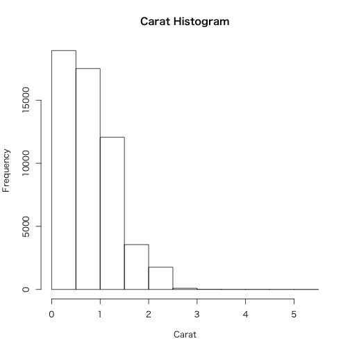
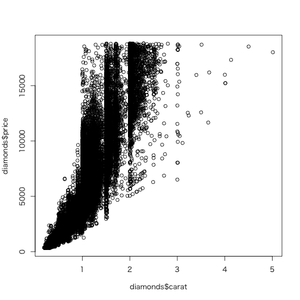
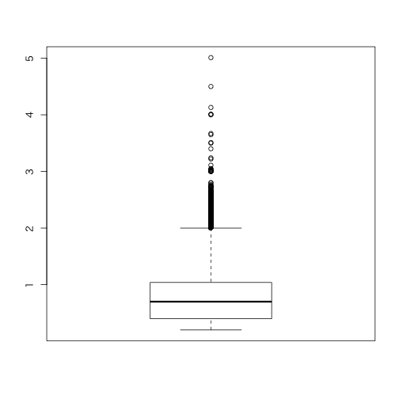

> R に組み込まれた機能や、lattice パッケージや ggplot2 パッケージのように後から追加 できるパッケージの形で、優れたグラフィクスの機能を提供します

> グラフィクスは統計学において、主に 2 つの理由で使用されます。1 つは探索的データ 解析(exploratory data analysis, EDA)、そしてもう1つは結果の説明のためです。

## 7.1 : 基本グラフィクス

Rに組み込まれてるデータセットは小さいので、ggplot2を使おう。


```r
require(ggplot2)
```

```
##  要求されたパッケージ ggplot2 をロード中です
```

```r
data(diamonds)
head(diamonds)
```

```
##   carat       cut color clarity depth table price    x    y    z
## 1  0.23     Ideal     E     SI2  61.5    55   326 3.95 3.98 2.43
## 2  0.21   Premium     E     SI1  59.8    61   326 3.89 3.84 2.31
## 3  0.23      Good     E     VS1  56.9    65   327 4.05 4.07 2.31
## 4  0.29   Premium     I     VS2  62.4    58   334 4.20 4.23 2.63
## 5  0.31      Good     J     SI2  63.3    58   335 4.34 4.35 2.75
## 6  0.24 Very Good     J    VVS2  62.8    57   336 3.94 3.96 2.48
```

## 7.1.1 : 基本グラフィクスのヒストグラム

ヒストグラム ある変数の値の分布を示す。


```r
hist(diamonds$carat, main = "Carat Histogram", xlab = "Carat")
```

 

ダイアモンドのキャラットの分布を示している。
X軸のラベルは`xlab`引数で設定されてりう。

## 7.1.2 : 基本グラフィクスの散布図

2つの変数を比べて見るときに散布図をよく使う。
ダイアモンドの価格とキャラット数の散布図を作成する。

まずはRのformula記法を使う


```r
plot(price ~ carat, data = diamonds)
```

 

`~`はprice と caratを分けている。
キャラットをx軸の値、priceをy軸の値としてる。

fomula記法を使わないでも、plotすることは可能で
`plot`に複数のデータを渡してあげればよい。


```r
plot(diamonds$carat, diamonds$price)
```

 

## 7.1.3 : 箱ひげ図

箱ひげ図(boxplot)は色々便利。

`boxplot`という関数で簡単に作れる


```r
boxplot(diamonds$carat)
```

 

